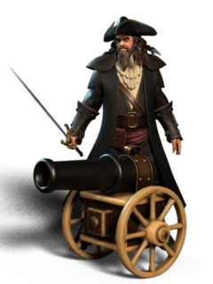

# 🗺 Adventures

On the Adventure page, you can choose to send your troops to [Dungeons ](adventures.md#dungeons)and defeat monsters then collect hidden treasures there or send them to [Treasure Island](adventures.md#treasure-island) to

<figure><figcaption></figcaption></figure>

### Dungeons

<figure><figcaption></figcaption></figure>

You can send your troops to find a dungeon and fight monsters and defeat them to get treasures from the dungeons. It may take a few days for your troops to find a dungeon. There is a chance for you to find rare items for your troops or if you have free spot in you barracks you may capture dragons or goblins in dungeons in order to use them in your army in future adventures.

<figure><figcaption></figcaption></figure>

### Treasure Island

<figure><figcaption>
Treasure Islands Map
</figcaption></figure>

You can set your army to explore and find treasures. It may take 6 hours or few days to find a treasure island. It depends how many players like you are looking for treasures and how many treasures already found. There might be enemies on the island therefore you have to defeat them to capture the island. Then you have to spend time to find treasures and collecting them. Collecting speed depends on the sum of the attack power of your survived heroes and it's 1 resource (CLEG / Stone / Iron) per 1 attack power per day at Cycle **20**. Collect speed decreases 5% per cycle. And also, you have to be ready to defend yourself from the ambush of other players to capture your island. You can create defensive structures.

<figure><figcaption>
A Treasure Island Map
</figcaption></figure>

If you see that someone is already on the island, you can attack him/her to capture the island. You can scout the island by paying some CLEG to get valuable information about enemy units and defensive structures.

In treasure Island despite of a lot of CLEG, stone, and iron, you can find valuable items and capture strong pirate troops.
