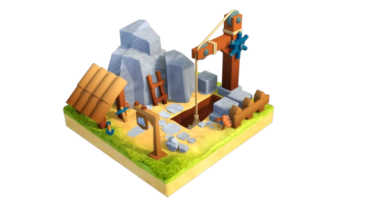
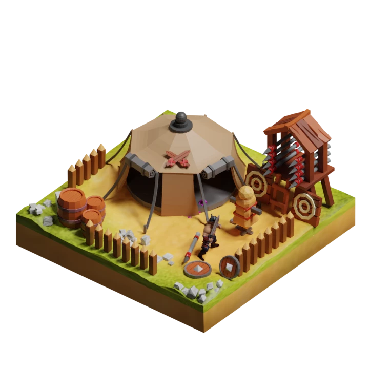

# ⛏ Buildings

Resource Buildings helps you to gather CLEG tokens, Stone, and Iron to make your progress in the game. Resource Buildings have Health. They lose 2 HP per day and will stop working when their HP reaches 0. You can repair them by paying Game's token. Buildings Loss 5% of their performance by losing every 20 HP. The repair cost to recover 100 HP is 50% of the building value(The cost to build and upgrade the building to reach the current level).

Resource buildings also have a capacity You have to collect their resources before they get full and stop working.

### CLEG Token Mine

Level 1 is free for all. Everyone has a free CLEG mine with 50 CLEG Production Per day. Max Cap: 50 CLEG.&#x20;

| Level | Upgrade Time | Upgrade Cost | Production \* | Max Cap   |
| ----- | ------------ | ------------ | ------------- | --------- |
| 1     | 0 hours      | Free         | 50 CLEG       | 50 CLEG   |
| 2     | 12 hours     | 1,000 CLEG   | 95 CLEG       | 100 CLEG  |
| 3     | 24 hours     | 2,000 CLEG   | 181 CLEG      | 200 CLEG  |
| 4     | 36 hours     | 4,000 CLEG   | 343 CLEG      | 400 CLEG  |
| 5     | 48 hours     | 8,000 CLEG   | 652 CLEG      | 800 CLEG  |
| 6     | 60 hours     | 16,000 CLEG  | 1,238 CLEG    | 1600 CLEG |
| 7     | 72 hours     | 32,000 CLEG  | 2,352 CLEG    | 3200 CLEG |
| 8     | 84 hours     | 64,000 CLEG  | 4,469  CLEG   | 6400 CLEG |


&#x20;\*  Production numbers are related to cycle 1. In the next cycles, production will be reduced. Read more about [Mining Cycles](../price-stability.md#mining-cycles).


### Stone Mine

| Level | Upgrade Time | Cost       | Production \* | Max Cap     |
| ----- | ------------ | ---------- | ------------- | ----------- |
| 1     | 12 hours     | 400 CLEG   | 100 Stone     | 100 Stone   |
| 2     | 24 hours     | 400 CLEG   | 190 Stone     | 200 Stone   |
| 3     | 36 hours     | 800 CLEG   | 361 Stone     | 400 Stone   |
| 4     | 48 hours     | 1600 CLEG  | 686 Stone     | 800 Stone   |
| 5     | 60 hours     | 3200 CLEG  | 1303 Stone    | 1600 Stone  |
| 6     | 72 hours     | 6400 CLEG  | 2476 Stone    | 3200 Stone  |
| 7     | 84 hours     | 12800 CLEG | 4705 Stone    | 6400 Stone  |
| 8     | 96 hours     | 25600 CLEG | 8939 Stone    | 12800 Stone |


\*  Production numbers are related to cycle 1. In the next cycles, production will be reduced. Read more about [Mining Cycles](../price-stability.md#mining-cycles).


### Iron Mine

Level 1: 500 CLEG Cost. 50 Iron Production Per day. Max Cap 50 Irons. Build Time: 12 hours

| Level | Upgrade Time | Cost                              | Production \* | Max Cap    |
| ----- | ------------ | --------------------------------- | ------------- | ---------- |
| 1     | 12 hours     | 
500 CLEG,

500 Stone
  | 100 Iron      | 100 Iron   |
| 2     | 24 hours     | 
500 CLEG,

500 Stone
  | 190 Iron      | 200 Iron   |
| 3     | 36 hours     | 
1000 CLEG, 1000 Stone
   | 361 Iron      | 400 Iron   |
| 4     | 48 hours     | 
2000 CLEG, 2000 Stone
   | 686 Iron      | 800 Iron   |
| 5     | 60 hours     | 
4000 CLEG, 4000 Stone
   | 1303 Iron     | 1600 Iron  |
| 6     | 72 hours     | 
8000 CLEG, 8000 Stone
   | 2476 Iron     | 3200 Iron  |
| 7     | 84 hours     | 
16000 CLEG, 16000 Stone
 | 4705 Iron     | 6400 Iron  |
| 8     | 96 hours     | 
32000 CLEG, 32000 Stone
 | 8939 Iron     | 12800 Iron |


\*  Production numbers are related to cycle 1. In the next cycles, production will be reduced. Read more about [Mining Cycles](../price-stability.md#mining-cycles).


## Barracks

Barracks Uses to train troops and heal them after a battle. Train speed / Combine Time: 12 hours. Healing 10 per hour. Max Cap: 5.&#x20;

By upgrading barracks, Max Cap will increase by 2 per level. And Armor, Damage, and Magic Resistance of units will increase by 10% per level.

| Level | Upgrade Time | Cost                                             | Healing/Hour \* | Capacity | Bonus Stats \*\* |
| ----- | ------------ | ------------------------------------------------ | --------------- | -------- | ---------------- |
| 1     | 12 hours     | 
1000 CLEG, 1000 Stone, 1000 Iron
    | 10 HP           | 5 Units  | 0%               |
| 2     | 24 hours     | 
1000 CLEG, 1000 Stone, 1000 Iron
    | 20 HP           | 7 Units  | 10%              |
| 3     | 36 hours     | 
2000 CLEG, 2000 Stone, 2000 Iron
    | 40 HP           | 9 Units  | 20%              |
| 4     | 48 hours     | 
4000 CLEG, 4000 Stone, 4000 Iron
    | 80 HP           | 11 Units | 40%              |
| 5     | 60 hours     | 
8000 CLEG, 8000 Stone, 8000 Iron
    | 160 HP          | 13 Units | 80%              |
| 6     | 72 hours     | 
16000 CLEG, 16000 Stone, 16000 Iron
 | 320 HP          | 15 Units | 160%             |
| 7     | 84 hours     | 
32000 CLEG, 32000 Stone, 32000 Iron
 | 640 HP          | 17 Units | 320%             |
| 8     | 96 hours     | 
64000 CLEG, 64000 Stone, 64000 Iron
 | 1280 HP         | 19 Units | 640%             |


&#x20;\*  Healing/Hour: When units are injured in battles, their HP will recover in Barracks equal to Healing/Hour divided by injured soldiers per hour. For Example, If Barrack's Healing/Hour is 10 and there are 5 Injured units, Each unit will receive 2 HP per hour.



&#x20;\*\*  Bonus Stats will add to Units' Damage, Armor, Magic Resistance, and Healing Power.


### Upgrades

Upgrades Take Time Depending on the building level. You can pay 10% more resources to get 24 hours deducted from the remaining time. For example, for a building that needs 1000 tokens and 3 days to get upgraded, you can pay 1300 tokens to upgrade your building instantly.

