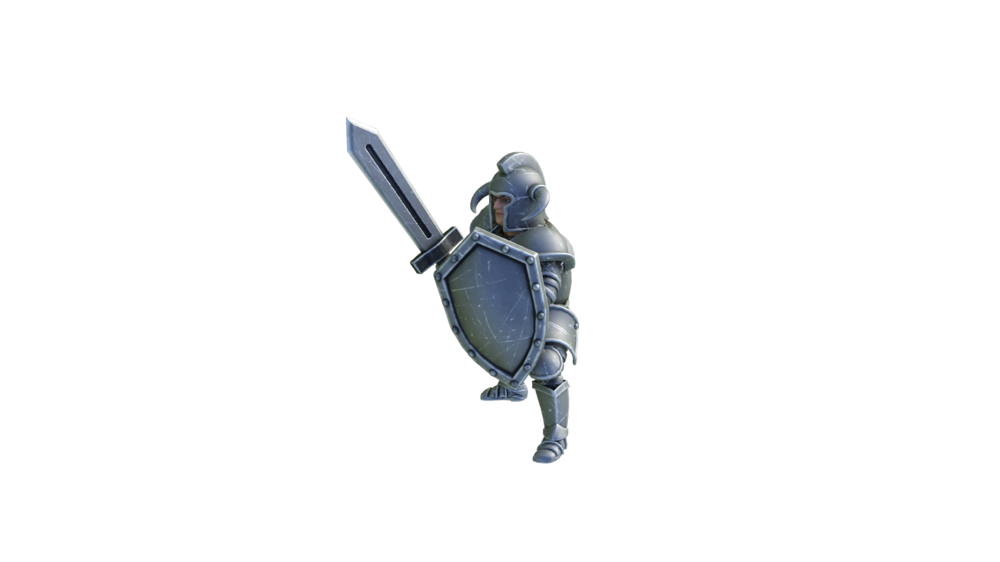

# 🪖 Troops

In [Barracks](buildings.md#barracks), you can train units. Some of the units are not trainable in barracks, but you can find them on [adventures](battles.md).

.png>) 

 

 

 

### Base Stats

| Name       | Damage                                                             | Defence                                                    | Resources                         |
| ---------- | ------------------------------------------------------------------ | ---------------------------------------------------------- | --------------------------------- |
| Warrior    | 
50 Physical Damage Attack Range: 1
                       | 
Armor: 100 HP: 200
                               | CLEG: 100, Iron: 30               |
| Archer     | 
30 Physical Damage Attack Range: 2
                       | 
Armor: 30 HP: 120
                                | CLEG: 80, Iron: 10                |
| Lieutenant | 
40 Physical Damage Attack Range: 1
                       | 
Armor: 200 HP:300 + 10% team armor
            | CLEG: 150, Iron: 60               |
| Knight     | 
80 Physical Damage Attack Range: 1
                       | 
Armor: 150 HP: 400
                               | CLEG: 300, Iron: 100              |
| Mage       | 
50 Magical Damage Attack Range: 3, 20 Healing to team
 | 
Armor: 20 HP: 100 + 100 team Magic Resistance
 | CLEG: 100, Iron 5                 |
| Catapult   | 
150 AOE** Physical Damage Range: 4
                       | 
Armor: 300 HP: 500
                               | CLEG: 1000, Iron: 300, Stone: 300 |
| Dragon     | 
100 AOE Magical Damage Range: 2
                          | 
Armor: 200 HP: 500
                               | 1% Drops in dungeons              |
| Goblin     | 
20 Physical Damage Range: 1
                              | 
Armor: 50 HP: 200
                                | 10% Drops in dungeons             |

\*\* AOE (Area of effect): Deals damage to units within 1 range distance of the target unit.

### Unit Levels

Units earn experience (XP) in battles. When they get enough XP, they will upgrade to the next Level. by upgrading to new levels, units' HP, Attack Damage, and Healing will increase by 50%. For ranged units, they will get 1 more attack range every 3 levels. For example, the table below shows the stats of Archer at each Level.

| Level | XP required | Attack | HP      | Attack Range |
| ----- | ----------- | ------ | ------- | ------------ |
| 1     | -           | 30     | 120 HP  | 2            |
| 2     | 10,000      | 45     | 180 HP  | 2            |
| 3     | 20,000      | 68     | 270 HP  | 2            |
| 4     | 40,000      | 101    | 405 HP  | 3            |
| 5     | 80,000      | 152    | 608 HP  | 3            |
| 6     | 160,000     | 228    | 911 HP  | 3            |
| 7     | 320,000     | 342    | 1367 HP | 4            |
| 8     | 640,000     | 513    | 2050 HP | 4            |
| 9     | 1,280,000   | 769    | 3075 HP | 4            |
| 10    | 2,560,000   | 1153   | 4613 HP | 5            |

The amount of XP that each unit earns in a battle is:\
**Unit's** **Battle XP** = **Total Damage Dealt** + **Total Damage Received** + **Total Healing Done**

### Combining Unit

You can combine 2 units with the same level to get 1 stronger unit with one level higher. The XP of the new unit is equivalent to the sum of previous units.

Example: if you combine two warriors with Level 3 and the first one has 10000 XP and the second one has 15000 XP, then you will get a new warrior with level 4 and 25000 XP
