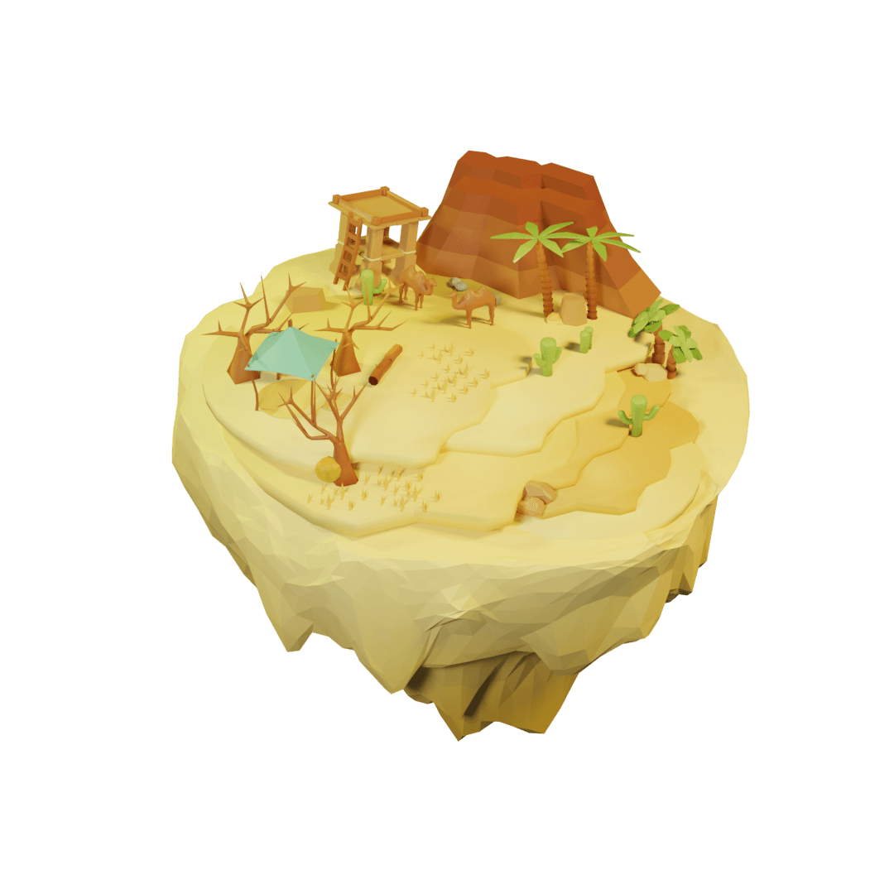
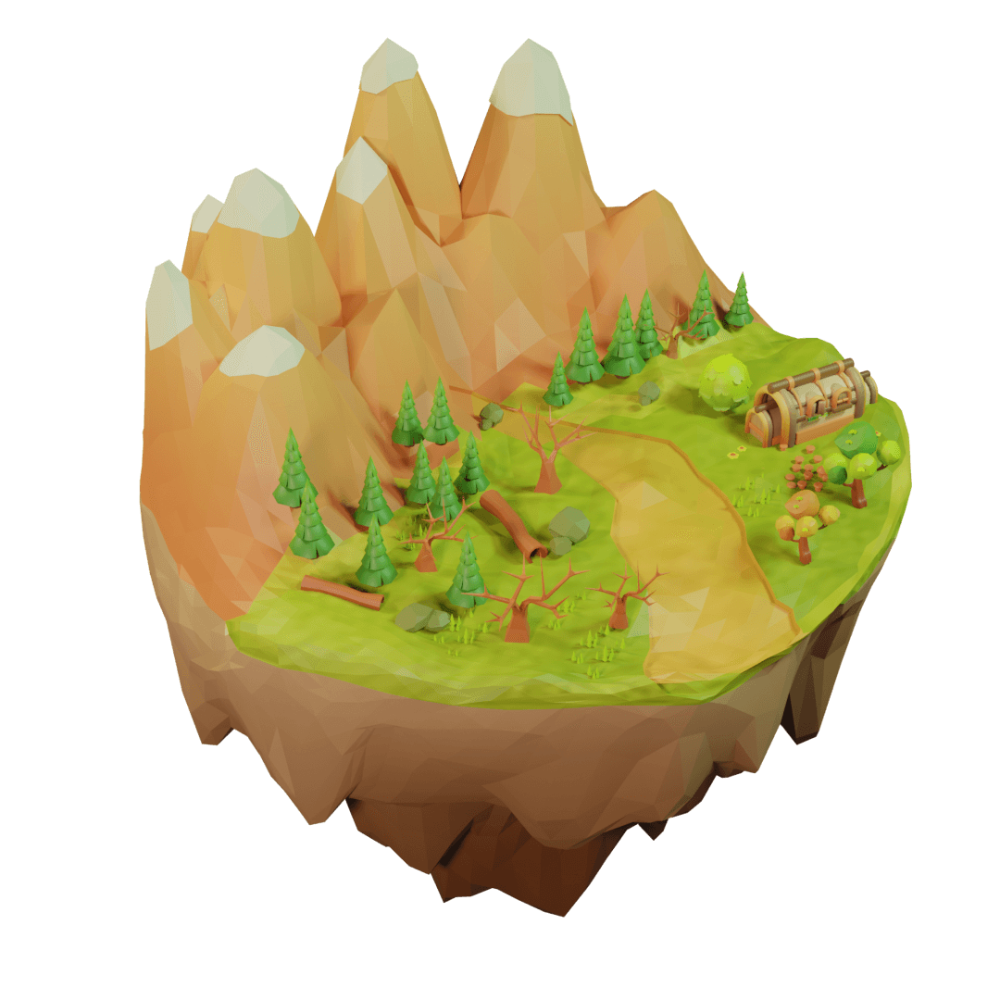
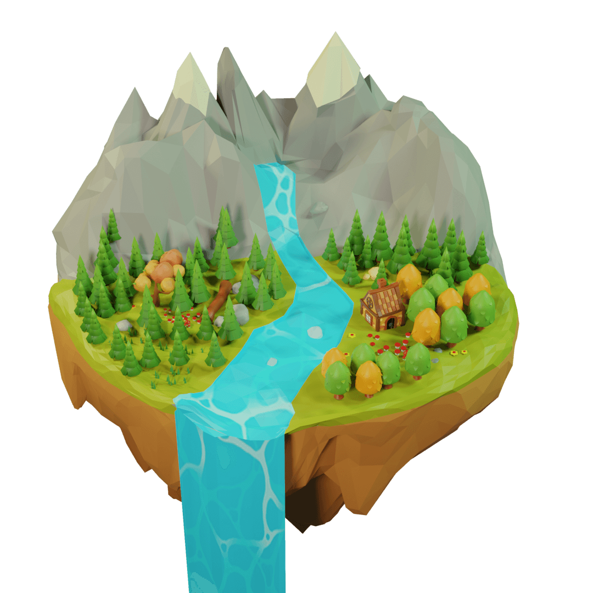
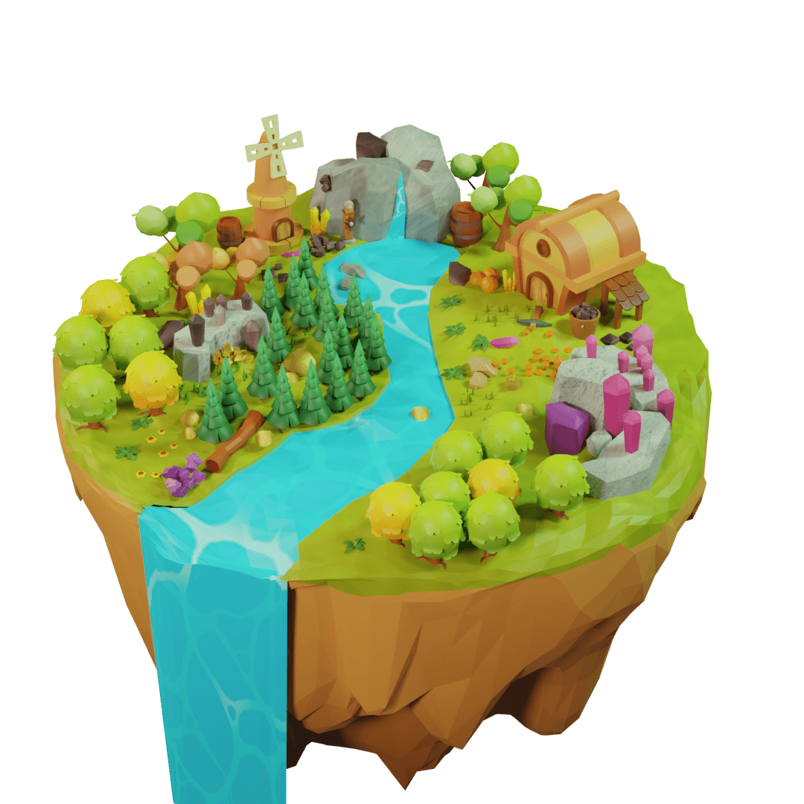
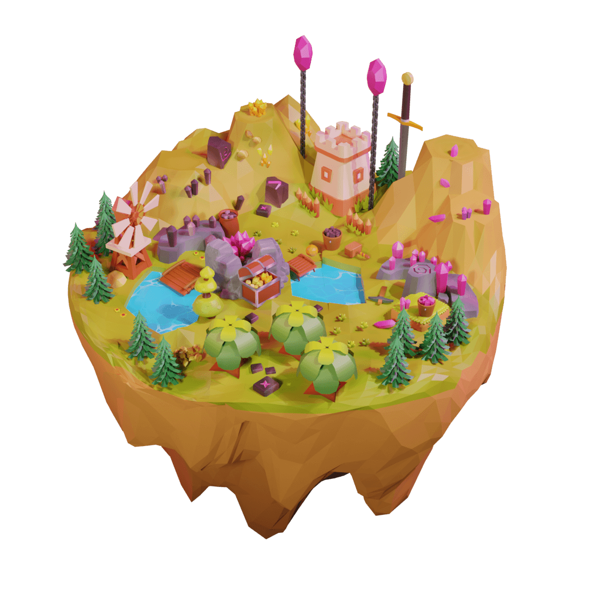

# 🏝 Lands

You need lands to deploy your [buildings ](buildings.md)and start earning resources. each land has a limited amount of resources. When resources of a land got finished, the land will be dismissed, and you have to find a new one. Lands are limited to the reward pool. They will be distributed to the users over time. To control inflation, When more users extract land resources, the reward pool’s tokens will get decreased, hence land distribution will get slower. This will help users’ assets to remain always valuable.&#x20;

There is 5 type of lands:

 

 


&#x20;\* after each [mining cycle](../price-stability.md#mining-cycles), resources of new lands will be deducted by 5%. read more about [mining cycles](../price-stability.md#mining-cycles)


