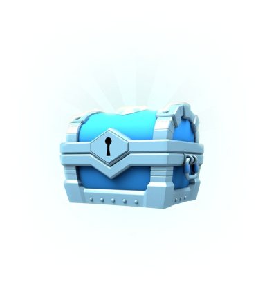
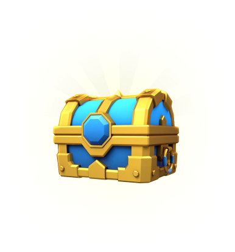
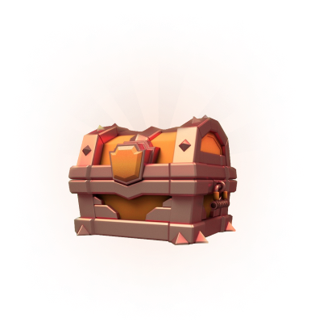
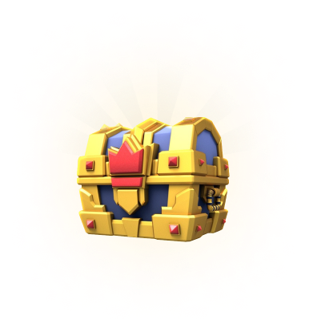

# 🎁 NFT Genesis Boxes

NFT Boxes contain a bunch of [lands](lands.md). You can obtain them from INO events or buy them from NFT marketplaces.&#x20;

Currently, Cycle #1 and Cycle #2 lands are released in form of NFT boxes.

* Cycle #1 Boxes: By purchasing these boxes you can open them when the game launches and get 30 to 45 [Lands](lands.md)&#x20;
* Cycle #2 Boxes: By purchasing these boxes you can open them when cycle #2 starts (expected 10 to 30 days after the launch of the game). and get 30 to 40 [Lands](lands.md). Cycle #2 Box's lands have 5% fewer resources than Cycle one's;

Read more about [Mining Cycles](../price-stability.md#mining-cycles)

### How to Obtain NFT Box

1. Tofunnft marketplace: [https://tofunft.com/collection/chain-of-legends-nft](https://tofunft.com/collection/chain-of-legends-nft)
2. Liquidifty INO: [https://app.liquidifty.io/@chainoflegends](https://app.liquidifty.io/@chainoflegends)

### Types of Boxes

   

<table><thead><tr><th width="153.1253615698304">Box Name</th><th width="150">Lands qty</th><th width="444.3677549388293">Land Drop Chance</th></tr></thead><tbody><tr><td>Cobalt</td><td>45</td><td>Common: 94%, Uncommon: 5%, Rare: 1%</td></tr><tr><td>Pyrite</td><td>40</td><td>Common: 46%, Uncommon:50%, Rare: 4%</td></tr><tr><td>Copper</td><td>30</td><td>Common: 37%, Uncommon:45%, Rare: 15%, Legendary: 3%</td></tr><tr><td>Gold Box</td><td>30</td><td>Common: 0%, Uncommon:36%, Rare: 44%, Legendary: 20%</td></tr></tbody></table>


You may not receive number of each type of lands exactly equal to its drop chance, you may receive of one type more than it's drop chance, and fewer from another type.

