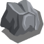
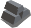

# 👷 Resources

###  CLEG Token

CLEG is the main game's token that you can obtain from exchanges, or mine it with [CLEG token Mine](buildings.md#cleg-token-mine) and [Lands](lands.md). CLEG is in-game currency and you need it for buildings and upgrades, training troops, trading in the [marketplace](marketplace.md), etc.

###  Stone

Stone is required to build and upgrade[ iron mine](buildings.md#iron-mine) and [barracks](buildings.md#barracks). Stone is also required to build a catapult for your [troops](heroes.md). You can obtain stones from the [marketplace ](marketplace.md)or mine them with the [stone mine](buildings.md#stone-mine).

###  Iron

Iron is required to build and upgrade[barracks](buildings.md#barracks). Iron is also required to train many of [troops](heroes.md). You can obtain Iron from the [marketplace ](marketplace.md)or mine it with the [iron mine](buildings.md#iron-mine).
