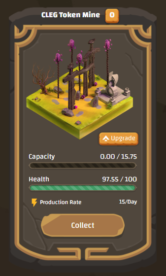

# Price Stability

We are using many mechanisms to control the price and reduce pumps, dumps, and continuous price decline that has happened to some blockchain games.

### Aggressive Token Burn

70% of all tokens that players spend in-game will burn, and the rest 30% will move back to the reward pool. The last token will be mined in the 2034 year or later. After that, we may use the reserved token pool to continue the game's economy.

### Mining Limits

Compound Interest is the #1 issue of blockchain games. In the beginning, players with little investment, reinvest their income into the game which is good for the game's economy. But after a while, they will reach an enormous huge income that grows faster than community growth, and when they start cashing out, which causes the token price will continuously decline.

To prevent this issue and control token supply in the market, we generate limited lands to mine per day. So there are limited tokens to mine every day like most blockchain coins. If all available lands get sold out, Players have to place bids for the next land so players have to pay more tokens to own land to begin mining. This will increase demand for the token and decrease the supply of the token.

### Mining Cycles

At the beginning of the game, 2000 lands (common, uncommon, rare, and legendary) will become available to buy every day. These lands have 1,300,000 tokens in total to mine. After every cycle, tokens of new Lands will be reduced by 5%. Token mining also reduces 5% after every cycle. The First cycle length is at least 10 days, the second cycle is 11 days, and every cycle is one day longer than the previous cycle. Cycle duration may become longer if all of the lands were not sold out.

### Conclusion

Chian of legends' deflationary systems, Limits token mining and supply, burn tokens aggressively, and reduce mining rewards over time. As a result game's tokens will become more and more rare and valuable. As NFTs are priced by game's token they will become more valuable over time even more valuable than tokens. for example, a legendary land in the early days of the game has \~14,000 tokens but a legendary land in the next 100 days has \~10,000 tokens. So buying and holding game tokens is very profitable, and game NFTs are even more profitable. Thanks to the deflationary system.
