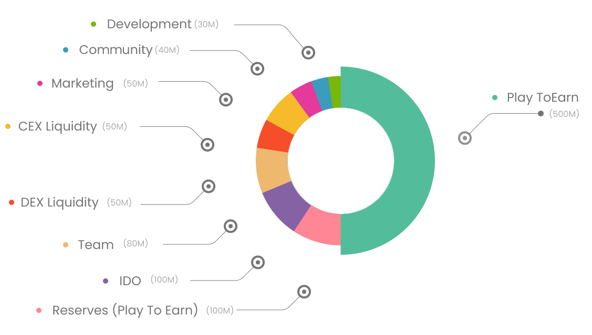

# 🪙 Tokenomics

Total Supply: 1,000,000,000 Tokens

Initial Supply: 100,000,000 Tokens

IDO price: 0.008$

|                                               | Total Supply | Percent | Vesting   |
| --------------------------------------------- | :----------: | :-----: | --------- |
| **Play to Earn**                              |     500M     |   50%   |           |
| **Reserved** (Play to Earn)                   |     100M     |   10%   |           |
| **IDO**                                       |     100M     |   10%   |           |
| **Team**                                      |      80M     |    8%   | 36 Months |
| **CEX Listing**                               |      50M     |    5%   |           |
| **Marketing**                                 |      50M     |    5%   | 36 Months |
| **Dex Liquidity**                             |      50M     |    5%   |           |
| **Community** (Airdrops / Rewards / Referral) |      40M     |    4%   | 24 Month  |
| **Development**                               |      30M     |    3%   | 18 Months |

Vesting tokens locked [unicrypt.network](https://app.unicrypt.network/amm/pancake-v2/token/0x4027d91eCD3140e53AE743d657549adfeEbB27AB) platform and vesting over time based on the vesting plan. You can see more details in the [Chain of Legends Token Vesting Google Sheet](https://docs.google.com/spreadsheets/d/1Z-Gc0C3G\_frqcQPOv7BdwGo-QaTbgm2UpO9uVBXfHR8/edit?usp=sharing).
