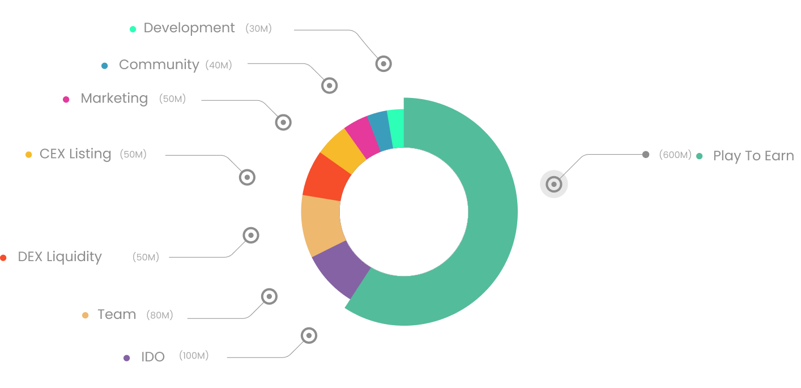

# 🪙 Tokenomics

Max Supply: 1,000,000,000 Tokens

Initial Supply: 100,000,000 Tokens

IDO Price: 0.008$

<table><thead><tr><th width="232.52851390579642"> </th><th width="152.43835616438355" align="center">Total Supply</th><th width="150" align="center">Percent</th><th>Vesting</th></tr></thead><tbody><tr><td><strong>Play to Earn *</strong> </td><td align="center">600M</td><td align="center">60%</td><td>40 Months</td></tr><tr><td><strong>IDO</strong></td><td align="center">100M</td><td align="center">10%</td><td></td></tr><tr><td><strong>Team</strong></td><td align="center">80M</td><td align="center">8%</td><td>36 Months</td></tr><tr><td><strong>CEX Listing</strong></td><td align="center">50M</td><td align="center">5%</td><td></td></tr><tr><td><strong>Marketing</strong></td><td align="center">50M</td><td align="center">5%</td><td>36 Months</td></tr><tr><td><strong>DEX Liquidity</strong></td><td align="center">50M</td><td align="center">5%</td><td></td></tr><tr><td><strong>Community</strong> (Airdrops / Rewards / Referral)</td><td align="center">40M</td><td align="center">4%</td><td>24 Month</td></tr><tr><td><strong>Development</strong></td><td align="center">30M</td><td align="center">3%</td><td>18 Months</td></tr></tbody></table>

Vesting tokens locked [unicrypt.network](https://app.unicrypt.network/amm/pancake-v2/token/0x4027d91eCD3140e53AE743d657549adfeEbB27AB) platform and vesting over time based on the vesting plan. You can see more details in the [Chain of Legends Token Vesting Google Sheet](https://docs.google.com/spreadsheets/d/1Z-Gc0C3G\_frqcQPOv7BdwGo-QaTbgm2UpO9uVBXfHR8/edit?usp=sharing).\
\
\* 600 million Play-to-Earn reward pool [locked on pinksale lock platform](https://www.pinksale.finance/pinklock/record/1012776?chain=BSC)

View [Token Burn Details](https://docs.google.com/spreadsheets/d/1jTGPdGgSPoGODWzqaJmpVmQr\_ePfBykKbV1Oh7nBhqU/edit?usp=sharing)
